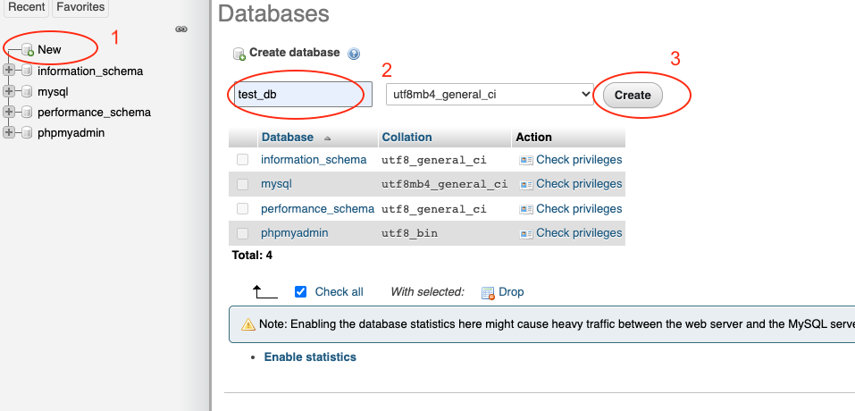
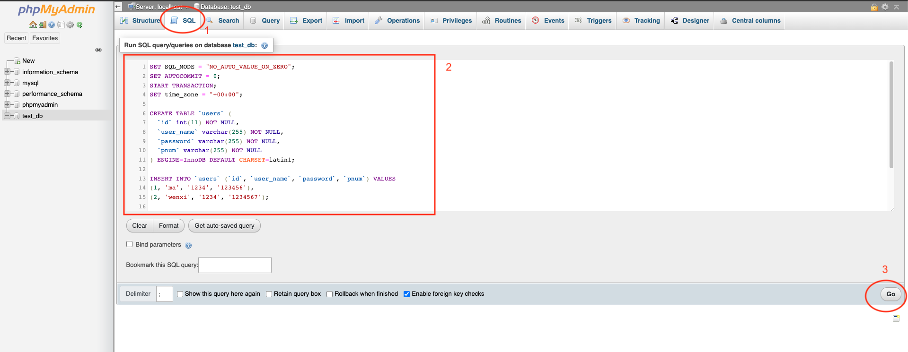

# Deliverable 4

## Students
- Wenxi Ma - 300051443
- Chethin Manage - 300066367

## Updates
- Update the UI design, makes all buttons have colors.
-Add footers about the policy and social media section.
- User End: User allow to change their password now,
-User allow to deactive their account(delete the account).
-User allow to go back to mainpage through their user homepage.

## Deployment
- [Live Demo](https://project-team-n.herokuapp.com/index.php) on Heroku
- Followed [online guide](https://www.doabledanny.com/Deploy-PHP-And-MySQL-to-Heroku) 

## Automated Testing
- PHPUnit initialized in ```tests/```
  - Run ```phpunit ActionTests.php``` after installing from [here](https://phpunit.readthedocs.io/en/9.5/installation.html)
- JavaScript testing is to be done using [Jest.js](https://jestjs.io/)
- Use case testing screenshots in ```screenshots/```

## Installation instructions (for MacOS)

1. Clone the github repo
2. Download [XAMPP](https://www.apachefriends.org/download.html)
3. Open XAMPP and click **Start** from the **General** tab
4. Navigate to the **Services** tab to make sure *MySQL* and *Apache* are running
5. Open your web browser and go to ```http://192.168.64.3/phpmyadmin/```
6. If you get an Access Denied Error, please follow [this guide](http://192.168.64.3/dashboard/docs/access-phpmyadmin-remotely.html) to fix it
7. Once there, click *New* link on the left side menu and create a database called ```test_db```

8. Copy and paste everything in the ```user_table_sql``` into the SQL tab and click *Go*

9. Go back to XAMPP Window
10. Navigate to the **Volumes** tab and click *Mount*, then *Explore*
11. Copy over all the files in ```root/deliverable_3/src/``` to ```opt/lampp/htdocs```
7. Once finished, go to ```http://192.168.64.3/``` to see the app in action! 
